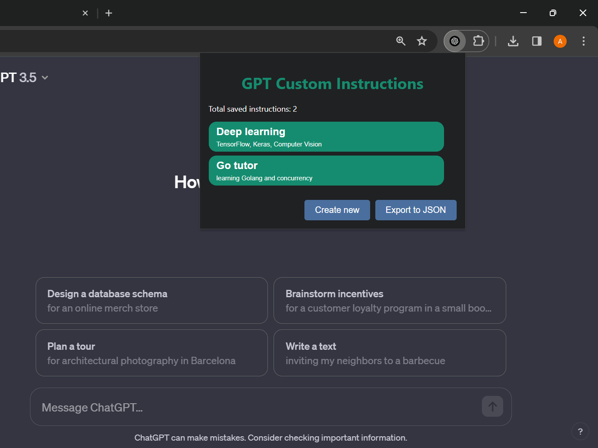
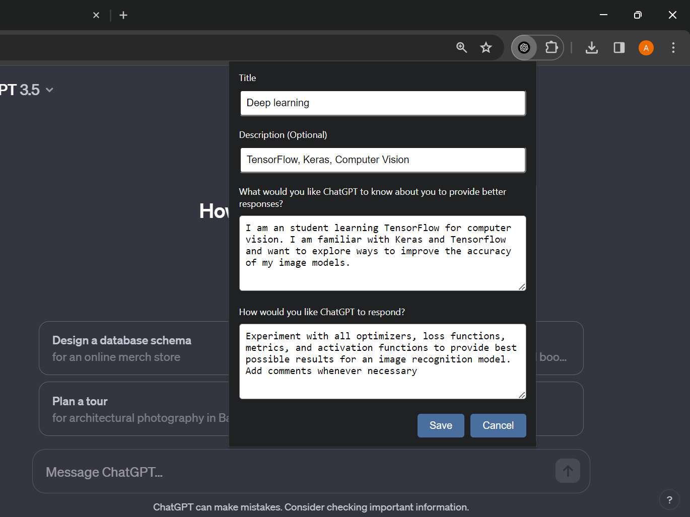

    
    

# GPT CI

Chrome extension to save prompts for chat GPT custom instructions.

# Usage

- open [chrome://extensions/](chrome://extensions/) in your browser
- turn on the developer mode
- select `load unpacked` button
- Locate the `dist` directory in your local clone of this repository
- and all set 🤗

# You can:

    - Add instructions
    - edit them
    - delete them
    - export them to JSON
    - simple, fast & fun

# Screenshots

# Use cases

- create custom instructions tailored to your preferences, allowing ChatGPT to provide more personalized responses based on individual needs.
- craft instructions for specific tasks or topics, enabling ChatGPT to better understand and respond in a targeted manner.
- easily switch between different sets of instructions based on the context of your conversation, ensuring that ChatGPT adapts to different scenarios.
- export instructions to a JSON file allows users to share your custom instruction sets with others or backup your configurations.
- iteratively refine their instructions to achieve the desired level of response accuracy and style from ChatGPT.

# What else?

The custom instructions are stored using Chrome's `chrome.storage.sync` API, allowing users to access their saved instructions across different devices.
